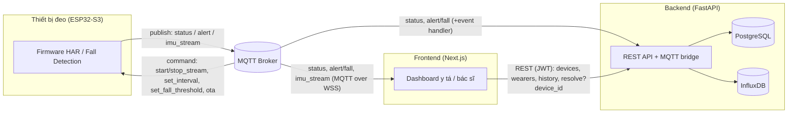
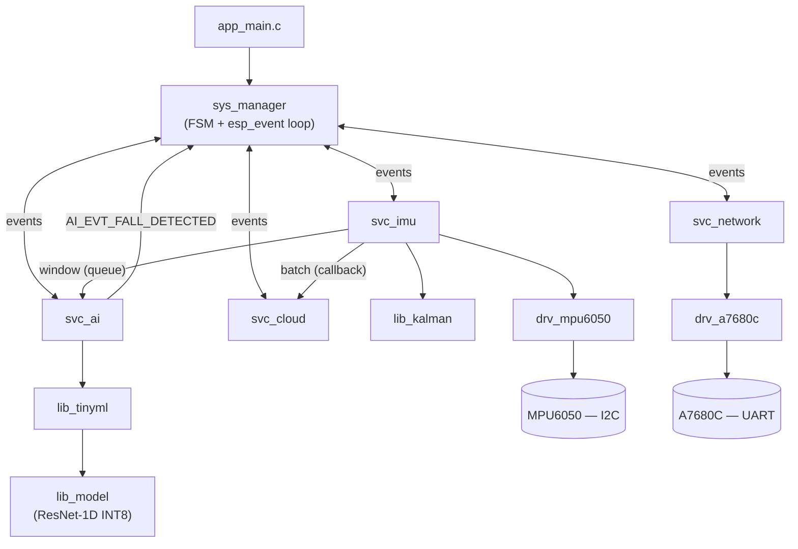

# Sơ đồ tích hợp hệ thống (System Integration Diagrams)

> **Cập nhật lần cuối:** 2026-06-18
> Tài liệu tập hợp các sơ đồ thể hiện mối quan hệ giữa các thành phần của hệ thống Eldercare (firmware ESP32 ↔ backend ↔ frontend ↔ pipeline học máy offline). Dùng cho mục đích trình bày kiến trúc tích hợp trong báo cáo nghiên cứu.

---

## 1. Tổng thể Runtime (End-to-End)

Sơ đồ thể hiện luồng vận hành thời gian thực giữa bốn khối lớn: thiết bị đeo, broker MQTT, backend và frontend.

Thiết bị publish ba nhóm dữ liệu lên broker theo tiền tố `eldercare/{device_id}/...`; backend đóng vai trò cầu nối (MQTT bridge) ghi xuống PostgreSQL (quan hệ) và InfluxDB (chuỗi thời gian); frontend vừa nhận realtime trực tiếp từ broker qua WebSocket, vừa truy vấn lịch sử/quản trị qua REST API.

> **Lưu ý topic realtime của FE (sau fix B1):** Frontend subscribe đúng `eldercare/+/status` (telemetry realtime) + `eldercare/+/alert/fall` — **KHÔNG có topic `telemetry` riêng** và không ai republish. FE map `battery`→`battery_pct`. `imu_stream` chỉ subscribe khi trang data-collection active. Resolve alert truyền `?device_id=` để hybrid fallback scope đúng thiết bị.

---

## 2. Kiến trúc nội bộ Firmware (Layered + Event-driven)

Firmware tổ chức theo bốn lớp (driver / library / service / system) và giao tiếp giữa các service **qua Event Loop của ESP-IDF** thay vì gọi hàm trực tiếp.

Quan hệ đáng chú ý: `svc_imu` đẩy cửa sổ dữ liệu sang `svc_ai` qua một FreeRTOS queue (không chặn), đẩy batch thô sang `svc_cloud` qua callback đã đăng ký; còn cảnh báo ngã được `svc_ai` phát lên Event Loop dưới dạng `AI_EVT_FALL_DETECTED` để `sys_manager`/`svc_cloud` xử lý. Cách này giúp các service decoupled, tránh phụ thuộc vòng tròn khi build.

---

## 3. Luồng dữ liệu realtime (một chu kỳ IMU)

Sơ đồ chi tiết hành trình của dữ liệu IMU từ cảm biến tới khi phát cảnh báo ngã.

```mermaid
flowchart LR
  MPU["MPU6050 @100Hz"] -->|"xung INT mỗi mẫu"| PCNT["PCNT đếm đủ 50 xung"]
  PCNT -->|"notify (ISR)"| TASK["imu_processing_task"]
  TASK --> KAL["Kalman 1D 6 trục<br/>+ chuẩn hóa [-1,1]"]
  KAL --> WIN["Sliding window 200 mẫu<br/>(trượt 50 mẫu / 0.5s)"]
  WIN -->|"svc_ai_process_window"| AI["svc_ai: TinyML inference"]
  AI -->|"prob(Fall) ≥ 0.6"| EVT["AI_EVT_FALL_DETECTED"]
  EVT --> SYS["sys_manager"]
  SYS --> CLOUD["svc_cloud"]
  CLOUD -->|"QoS1: eldercare/{id}/alert/fall"| BR[("MQTT Broker")]

  TASK -. "STATE_STREAMING" .-> CLOUD
  CLOUD -. "imu_stream / status (QoS0)" .-> BR
```

Điểm cốt lõi: PCNT gom 50 xung INT bằng phần cứng nên CPU chỉ thức dậy ~2 lần/giây; dữ liệu sau lọc Kalman và chuẩn hóa được dùng đồng nhất cho cả inference TinyML lẫn luồng streaming thu thập dataset.

---

## 4. Pipeline học máy offline (Data Collection → Model → Firmware)

Sơ đồ thể hiện vòng đời mô hình: thu thập dữ liệu từ thiết bị ở chế độ STREAMING, tiền xử lý/cắt window, huấn luyện offline, lượng tử hóa INT8 và nhúng ngược vào firmware để suy luận on-device.

```mermaid
flowchart LR
  DEV["Thiết bị (STATE_STREAMING)"] -->|"imu_stream MQTT"| BE["Backend /data-collection"]
  BE -->|"windowing (Scipy)"| INF[("InfluxDB: imu_windowed")]
  INF --> CSV["Dataset có nhãn (CSV)"]
  CSV --> TRAIN["Huấn luyện offline<br/>(ResNet-1D)"]
  TRAIN --> TFL["Model .tflite<br/>(quantize INT8)"]
  TFL --> CC["convert → model_data.cc"]
  CC --> FWLIB["firmware: lib_model"]
  FWLIB --> INFER["lib_tinyml: inference on-device"]
```

Mô hình triển khai hiện tại là **ResNet-1D** (input `(200, 6)`, output 5 lớp {Walk, Run, Idle, Transition, Fall}), lượng tử hóa INT8 và lưu dưới dạng C byte array trong `lib_model/model_data.cc`. Dữ liệu huấn luyện đi qua đúng quy trình tiền xử lý như lúc inference (đổi hệ trục → Kalman → chuẩn hóa) để tránh lệch phân phối train/serve.

> *Sơ đồ này ở mức khái niệm, dựng từ code hiện có. Nếu bạn có tên công cụ/khâu cụ thể trong quy trình train (notebook, framework, script export…), gửi tôi để bổ sung chi tiết.*
