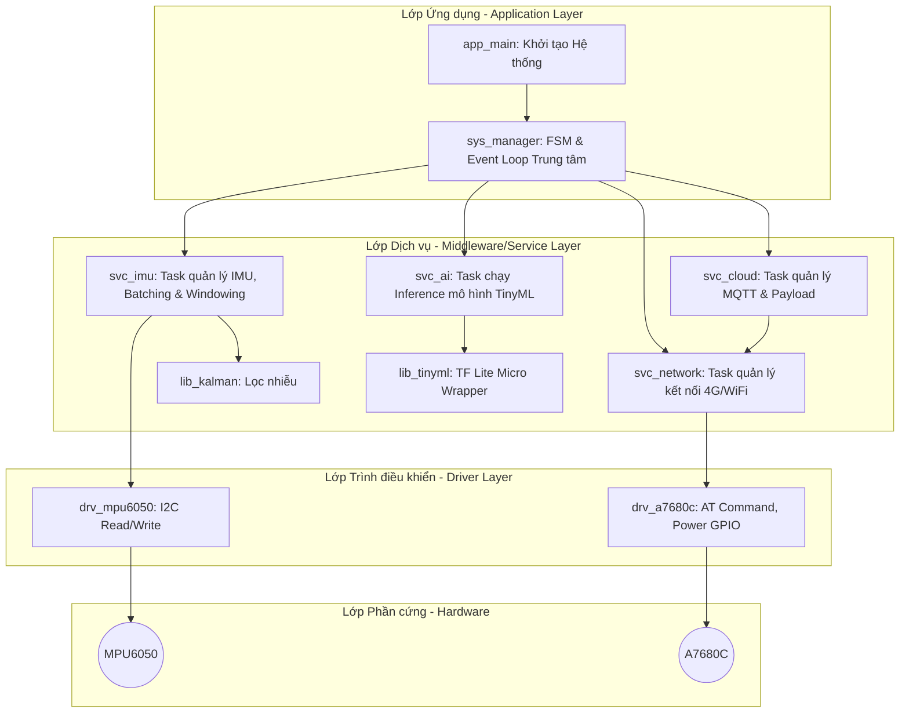
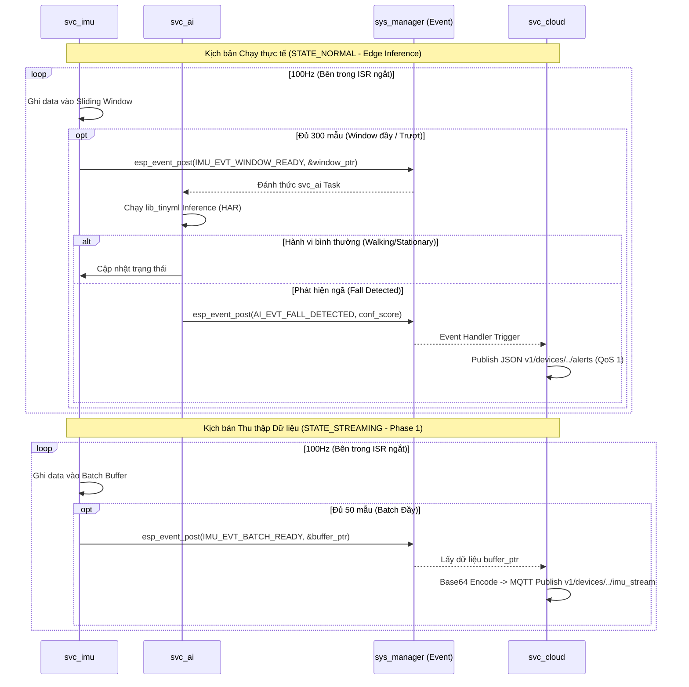

# FIRMWARE ARCHITECTURE DESIGN (ESP32-S3)

Tài liệu này mô tả chi tiết kiến trúc phần mềm của Firmware dựa trên mô hình Hướng sự kiện (Event-Driven) và Máy trạng thái hữu hạn (FSM) cho **Toàn bộ vòng đời dự án (Phase 1 & Phase 2)**. Mục tiêu là đảm bảo tính module hóa, tích hợp mượt mà mô hình TinyML AI mà không phá vỡ luồng thu thập dữ liệu tần số cao.

## 1. Kiến trúc phân lớp (Layered Architecture)

Hệ thống được chia thành 3 lớp riêng biệt, tuân thủ nguyên tắc: Lớp trên gọi lớp dưới, lớp dưới trả kết quả về lớp trên thông qua Event hoặc Callback.



## 2. Cấu trúc thư mục Project

```text
d:\datn\firmware\
├── CMakeLists.txt
├── main/
│   ├── CMakeLists.txt
│   └── app_main.c         # Điểm bắt đầu (Entry point).
└── components/
    ├── drv_mpu6050/       # Giao tiếp I2C với cảm biến MPU6050 (thanh ghi, ngắt).
    ├── drv_a7680c/        # Giao tiếp UART, điều khiển nguồn (GPIO) cho module 4G.
    ├── lib_kalman/        # Thư viện thuật toán lọc Kalman.
    ├── lib_tinyml/        # [PHASE 2] Wrapper bọc thư viện TF Lite Micro hoặc Edge Impulse.
    ├── svc_imu/           # FreeRTOS Task: Quản lý RingBuffer/Sliding Window, Pedometer.
    ├── svc_ai/            # [PHASE 2] FreeRTOS Task: Chờ dữ liệu từ Sliding Window để Inference.
    ├── svc_network/       # FreeRTOS Task: Quản lý kết nối mạng (WiFi/PPPoS).
    ├── svc_cloud/         # FreeRTOS Task: MQTT Client, Payload Serialization.
    └── sys_manager/       # Định nghĩa Event Base, State Enum, hàm chuyển trạng thái.
```

## 3. Sơ đồ Máy Trạng Thái (FSM - Finite State Machine)

Toàn bộ hệ thống được điều phối bởi FSM trung tâm. `STATE_NORMAL` chính là chế độ Production (chạy AI liên tục), trong khi `STATE_STREAMING` dùng để thu thập Data Train (chỉ đơn thuần đẩy dữ liệu lên Cloud).

```mermaid
stateDiagram-v2
    [*] --> STATE_INIT: Cấp nguồn
    
    STATE_INIT --> STATE_CONNECTING: app_main khởi tạo xong Services
    
    STATE_CONNECTING --> STATE_NORMAL: Mạng & MQTT Sẵn sàng
    STATE_CONNECTING --> STATE_CONNECTING: Rớt mạng (Tự động retry)
    
    STATE_NORMAL --> STATE_STREAMING: Nhận CMD bắt đầu Data Collection
    STATE_NORMAL --> STATE_OTA: Nhận CMD cập nhật Firmware
    
    %% Ở STATE_NORMAL, hệ thống tự động chạy AI Inference
    note right of STATE_NORMAL
      <b>Chế độ Production (Phase 2):</b>
      - Quét AI (HAR/Fall) liên tục.
      - Gửi Telemetry 1 phút/lần.
      - Gửi Alert ngay khi ngã.
    end note
    
    STATE_STREAMING --> STATE_NORMAL: Nhận CMD dừng Data Collection
    
    STATE_OTA --> [*]: Restart ESP32
```



## 4. Mô hình tương tác giữa các Task (Đã bao gồm AI Inference)

Dưới đây là sơ đồ mở rộng cho bản Full. Mấu chốt là `svc_imu` đẩy dữ liệu vào **Sliding Window (Cửa sổ trượt)**, sau đó thông báo cho `svc_ai` chạy nhận diện hành vi (HAR/Fall Detection) thay vì đẩy trực tiếp lên mạng.



## 5. Nguyên tắc thiết kế Data Processing & AI (Phase 2)

1. **Sliding Window (Cửa sổ trượt)**: Ở Phase 2, để không bỏ sót các pha ngã diễn ra ở giữa 2 batch độc lập, `svc_imu` bắt buộc phải dùng kỹ thuật Sliding Window (VD: Cửa sổ 3 giây = 300 mẫu, trượt mỗi 0.5 giây = 50 mẫu). `svc_ai` sẽ được đánh thức mỗi khi cửa sổ trượt đi một nấc.
2. **Không Blocking luồng đo IMU**: Hàm AI Inference (TensorFlow Lite) có thể mất vài chục ms để tính toán. Do đó, logic AI bắt buộc phải nằm trong Task riêng (`svc_ai`), để không làm gián đoạn ngắt 100Hz của cảm biến IMU đang chạy trong `svc_imu`.
3. **Chống Spam Cảnh Báo (Debounce/Cooldown)**: Trong quá trình ngã (diễn ra trong 1-2 giây), model AI có thể kích hoạt nhiều lần (Nhiều Sliding Windows cùng chứa pha ngã). Task `svc_ai` phải có cơ chế Cooldown (VD: Đã cảnh báo thì im lặng 10-20 giây) để chỉ gửi đúng 1 thông điệp lên Dashboard thông qua `CLOUD`.
